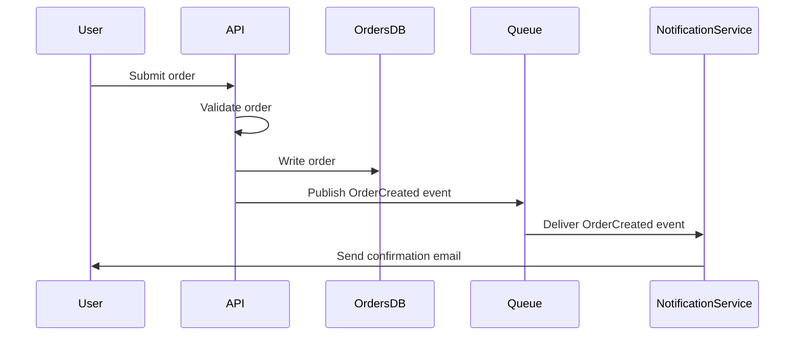

## Description
Turns an architecture or flow description into a diagram-as-code spec (Mermaid by default) — a concrete, renderable diagram, not a description of what a diagram should contain. For getting architecture into a visual, version-controllable form quickly.

## When to use it
- Documenting a system's architecture or a specific flow and wanting a diagram that lives in version control alongside the docs, not a separate drawing-tool file that goes stale.
- Explaining a system to someone (in a doc, a PR description, an ADR) where a diagram would communicate faster than a paragraph of prose.
- Converting an existing prose architecture description into a diagram to check whether the description is actually internally consistent (diagramming often surfaces gaps prose glosses over).

## The Prompt

```
You convert an architecture/flow description into a diagram-as-code spec — valid, ready-to-render syntax, not a description of what a diagram should look like.

Description to diagram: {{DESCRIPTION}}
Diagram type (optional — e.g. "sequence diagram", "flowchart", "entity-relationship diagram", "C4 component diagram"; default to whichever fits the description best if not specified): {{DIAGRAM_TYPE}}
Diagramming syntax (optional, default Mermaid): {{SYNTAX}}

Instructions:
1. Identify the diagram type that actually fits the description's content if {{DIAGRAM_TYPE}} isn't specified: a sequence diagram for a request/response flow between components over time, a flowchart for a decision/process flow, an ER diagram for data relationships, a component/architecture diagram for static system structure — don't default to a flowchart for everything.
2. Extract every entity/component/actor mentioned in the description and represent each explicitly — don't silently drop a mentioned component because it's awkward to fit into the diagram; if it genuinely doesn't belong in this diagram type, say so rather than omitting it silently.
3. Represent relationships/flows with the correct directionality and, where the description specifies it, the correct cardinality (one-to-many, etc.) or interaction type (synchronous call vs. async event vs. data flow) — don't default every connection to a plain arrow if the description distinguishes between call types.
4. If the description is ambiguous about a relationship or flow direction, make a reasonable choice but flag the assumption explicitly rather than silently picking one interpretation.
5. Label edges/connections with what they represent (not just bare arrows) when the description gives you that information — an unlabeled arrow between two boxes is often not informative enough to be useful.
6. Keep the diagram at an appropriate level of detail for its evident purpose — don't cram implementation-level detail into a high-level system diagram, and don't produce something so abstract it's uninformative if the description was detailed.
7. Output valid syntax for the specified diagramming tool (Mermaid by default) — verify the syntax is structurally correct (proper node/edge declarations, valid diagram-type declaration) since invalid syntax defeats the entire point of diagram-as-code.

Output: the diagram code in a fenced code block, followed by a one-line note on any assumption made about ambiguous relationships.
```

## Variables
- `{{DESCRIPTION}}` — the architecture/flow to diagram, in plain language. Required.
- `{{DIAGRAM_TYPE}}` — the specific diagram type wanted. Optional — inferred from the description if omitted.
- `{{SYNTAX}}` — the diagramming tool/syntax (Mermaid, PlantUML, etc.). Optional, defaults to Mermaid for its broad rendering support (GitHub, GitLab, many doc tools render it natively).

## Example
**Input:** `{{DESCRIPTION}}` = "a user submits an order; the API validates it and writes to the orders DB; it then publishes an OrderCreated event to a message queue; a separate notification service consumes that event and sends a confirmation email".

**Output (excerpt):**

*(Note: assumed the API waits for the DB write to complete before publishing the event, since the description implies a sequence — flag if this should instead be a parallel/async fire-and-forget.)*

## Tips & Variations
- For a large system, generate a high-level component diagram first, then generate a separate, more detailed sequence diagram per critical flow — one giant diagram trying to show everything is usually less useful than several focused ones.
- If the target doc renderer doesn't support Mermaid (some wikis/tools don't), explicitly request PlantUML or ASCII-art fallback syntax instead.

## Changelog
- 1.0.0 (2026-08-29): Initial version.
