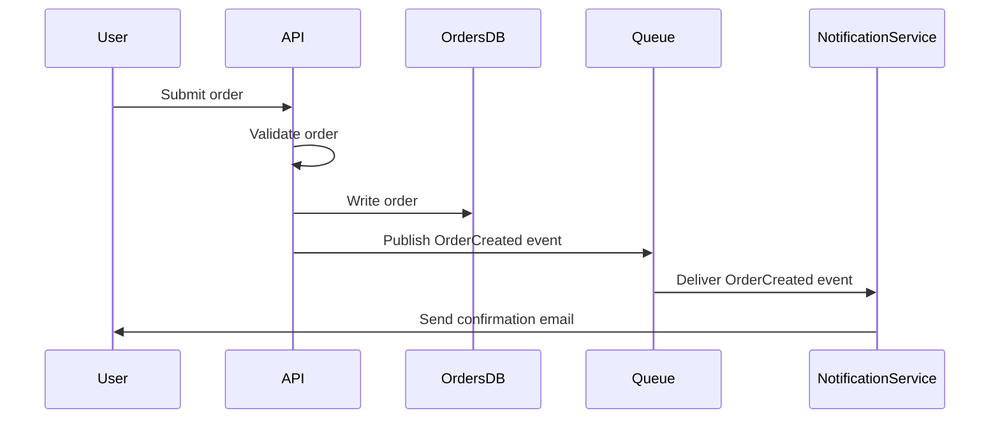

## Опис
Перетворює опис архітектури чи потоку на специфікацію diagram-as-code (за замовчуванням Mermaid) — конкретну, рендерувану діаграму, не опис того, що діаграма має містити. Для швидкого приведення архітектури до візуальної, контрольованої версіями форми.

## Коли використовувати
- Документування архітектури системи чи конкретного потоку з бажанням отримати діаграму, що живе в системі контролю версій поряд з документацією, не окремий файл інструмента малювання, що застаріває.
- Пояснення системи комусь (у документі, описі PR, ADR), де діаграма комунікувала б швидше за абзац прози.
- Перетворення наявного прозового опису архітектури на діаграму, щоб перевірити, чи опис дійсно внутрішньо узгоджений (діаграмування часто виявляє прогалини, які проза згладжує).

## Промпт

```
Ти перетворюєш опис архітектури/потоку на специфікацію diagram-as-code — валідний, готовий до рендерингу синтаксис, не опис того, як діаграма має виглядати.

Опис для діаграмування: {{DESCRIPTION}}
Тип діаграми (необов'язково — напр., "діаграма послідовності", "блок-схема", "діаграма сутність-зв'язок", "компонентна діаграма C4"; за замовчуванням обери той, що найкраще відповідає опису, якщо не вказано): {{DIAGRAM_TYPE}}
Синтаксис діаграмування (необов'язково, за замовчуванням Mermaid): {{SYNTAX}}

Інструкції:
1. Визнач тип діаграми, що фактично відповідає вмісту опису, якщо {{DIAGRAM_TYPE}} не вказано: діаграма послідовності для потоку запит/відповідь між компонентами в часі, блок-схема для потоку рішень/процесу, ER-діаграма для зв'язків даних, компонентна/архітектурна діаграма для статичної структури системи — не переходь за замовчуванням до блок-схеми для всього.
2. Витягни кожну сутність/компонент/актора, згаданого в описі, і представ кожен явно — не мовчки випускай згаданий компонент, бо його незручно вписати в діаграму; якщо він дійсно не належить цьому типу діаграми, скажи про це, а не мовчки пропускай.
3. Представ зв'язки/потоки з правильною спрямованістю і, де опис це вказує, правильною кардинальністю (один-до-багатьох тощо) чи типом взаємодії (синхронний виклик проти асинхронної події проти потоку даних) — не переходь за замовчуванням до простої стрілки для кожного з'єднання, якщо опис розрізняє типи викликів.
4. Якщо опис неоднозначний щодо зв'язку чи напрямку потоку, зроби розумний вибір, але явно познач припущення, а не мовчки обирай одну інтерпретацію.
5. Позначай ребра/з'єднання тим, що вони представляють (не лише голими стрілками), коли опис дає цю інформацію — непозначена стрілка між двома блоками часто недостатньо інформативна, щоб бути корисною.
6. Тримай діаграму на відповідному рівні деталізації для її очевидного призначення — не запихуй деталь рівня реалізації в високорівневу системну діаграму, і не продукуй щось настільки абстрактне, що воно неінформативне, якщо опис був детальним.
7. Видавай валідний синтаксис для вказаного інструмента діаграмування (Mermaid за замовчуванням) — перевір, що синтаксис структурно коректний (правильні декларації вузлів/ребер, валідна декларація типу діаграми), оскільки невалідний синтаксис зводить нанівець увесь сенс diagram-as-code.

Вивід: код діаграми в блоці коду з fenced-обгорткою, за яким слідує однорядкова примітка про будь-яке припущення щодо неоднозначних зв'язків.
```

## Змінні
- `{{DESCRIPTION}}` — архітектура/потік для діаграмування, простою мовою. Обов'язково.
- `{{DIAGRAM_TYPE}}` — конкретний бажаний тип діаграми. Необов'язково — виводиться з опису, якщо пропущено.
- `{{SYNTAX}}` — інструмент/синтаксис діаграмування (Mermaid, PlantUML тощо). Необов'язково, за замовчуванням Mermaid через широку підтримку рендерингу (GitHub, GitLab, багато інструментів документації рендерять його нативно).

## Приклад
**Вхід:** `{{DESCRIPTION}}` = "користувач надсилає замовлення; API валідує його й записує в БД orders; потім публікує подію OrderCreated у чергу повідомлень; окремий сервіс сповіщень споживає цю подію й надсилає лист-підтвердження".

**Вихід (фрагмент):**

*(Примітка: припущено, що API чекає завершення запису БД перед публікацією події, оскільки опис натякає на послідовність — познач, якщо це натомість має бути паралельний/асинхронний fire-and-forget.)*

## Поради та варіації
- Для великої системи спочатку згенеруй високорівневу компонентну діаграму, потім згенеруй окрему, детальнішу діаграму послідовності на кожен критичний потік — одна гігантська діаграма, що намагається показати все, зазвичай менш корисна за кілька сфокусованих.
- Якщо цільовий рендерер документів не підтримує Mermaid (деякі вікі/інструменти не підтримують), явно запроси PlantUML чи запасний синтаксис ASCII-art.

## Історія змін
- 1.0.0 (2026-08-29): Початкова версія.
